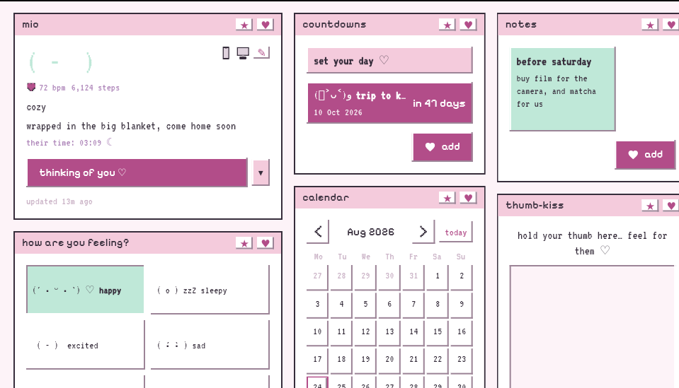
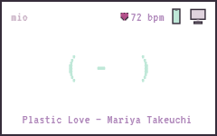
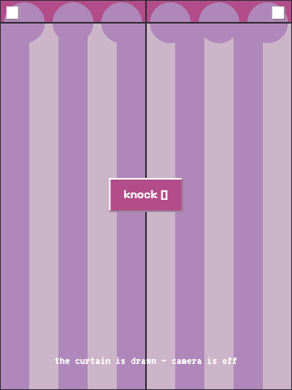

# Kehai — 気配

> *kehai (気配): the sense that someone is present — before you see or hear them.*
>
> **czuję, że tam jesteś (´-ω-`) ♡**

A self-hosted little world for two. Kehai is a private couples app — built for long-distance, lovely for any couple — that runs entirely on your own server and makes two people feel close all day: not through more messages, but through ambient signs of each other. What they're listening to. Whether they're at their computer or asleep. Their mood as a kaomoji. A doodle that appears on your screen because they were thinking of you.

Y2K pastel-pixel aesthetic — chunky retro windows, pixel fonts, soft pinks and lavenders, kaomoji everywhere.



## The little window

On desktop, Kehai mostly lives as a tiny always-there card in the corner of your screen: their mood as a kaomoji, what they're listening to, a pixel heart beating at their **real pulse** (from their watch, if they share it), and a ♥ to tap when you're thinking of them. Click it and the whole pastel desktop above unfolds.



## What's inside

- **Presence, gently** — on their phone / at their computer / away / probably asleep zzZ; now-playing from Spotify & friends (Windows, Linux, Android); which app they're in ("coding", "scrolling tiktok") — every signal an explicit opt-in, off by default
- **Smartwatch vitals** — steps today and a heart that beats at their actual BPM, via Health Connect
- **Moods** — kaomoji statuses with little notes, dropped as beads into a shared **mood jar** you can tip out together
- **The portal** — a video window between your homes: a drawn pixel curtain by default (camera provably *off* — watch your OS camera light), knock, and it opens only when both of you say so. Peer-to-peer, end-to-end encrypted, optional self-hosted TURN relay
- **Location** — built-in sharing or OwnTracks, with an honest ghost mode; distance-apart on a map
- **Together things** — a shared pet you both look after (it never dies, and it keeps a little story of everything you did), thumb-kiss (touch the same spot, feel a buzz), doodles onto each other's screens, photo instants, a daily question with a blind reveal (120 handwritten), calendar, countdowns, sticky notes, a freeform corkboard, shared files
- **Little rituals** — one-tap "thinking of you" pings (they show up everywhere, even the mini card), chiptune notification sounds you pick per event, dual clocks when you're in different timezones
- **Android, properly** — always-on status notification whose *status-bar icon changes with what they're doing* (a note for music, a keyboard for coding — each wearing a tiny heart), home-screen widget, background service that survives the app being closed
- **Smart home** — webhooks fire on mood/presence changes, ready for Home Assistant (turn the lamp pink when they're sad, obviously)

## The curtain



*The portal's resting state. The camera is not on behind this curtain — the connection doesn't exist until you knock and they answer.*

## Stack

- **Server**: single Go binary built on [PocketBase](https://pocketbase.io) (auth, SQLite, realtime, file storage) — ~50 MB RAM
- **Push**: self-hosted [ntfy](https://ntfy.sh) (UnifiedPush) — no Google required
- **Clients**: one Flutter codebase for Android, Windows, Linux (macOS/iOS someday)
- **Networking**: designed for [Tailscale](https://tailscale.com) — zero exposed ports

## Quickstart

```bash
# server (any box with Docker — a Pi is plenty)
cd deploy && docker compose up -d       # API on :8090, ntfy on :8091

# desktop client
cd app && flutter run -d linux          # or -d windows on Windows
```

Open the app, point it at your server address, register, create your couple, send the invite code to your person ♡

Windows note: build from a Windows-side checkout (not a WSL share) — Flutter toolchains fight over shared state. Android: `flutter build apk`.

## Self-hosting notes

Everything private-by-default: couple-scoped API rules, locked-down ntfy, no telemetry, no third-party APIs required (Spotify etc. are optional enrichment only). See `deploy/README.md` for setup, backups, and networking guidance.

## Installing releases

Kehai isn't on any store — it's sideloaded by the two of you, straight from a build. No update channel either: a new release just means "grab the new file, install it over the old one."

**Android**

```bash
adb install kehai-release.apk
# or copy the APK to the phone and tap it — allow "install unknown apps" for
# whatever app you copied it with (Files, a browser, etc.)
```

If your phone still has a *debug* build installed (from `flutter run`), uninstall it first — debug and release builds are signed with different keys, and Android refuses to install a differently-signed APK over an existing one with the same package name.

**Windows**

Unzip `kehai-windows-x64-<version>.zip` anywhere you like and run `couples_app.exe`. No installer, nothing written outside that folder. The tray menu's autostart toggle points at wherever you unzipped it — if you move the folder later, re-toggle autostart off and back on so it re-points itself.

**Linux**

```bash
tar xzf kehai-linux-x64-<version>.tar.gz
cd kehai-linux-x64-<version>
./install.sh          # copies to ~/.local/opt/kehai, adds a launcher entry
# ./uninstall.sh       # removes both, cleanly, whenever
```

No sudo, nothing outside `$HOME`. `scripts/package-linux.sh` builds this tarball from a `flutter build linux --release` bundle, if you're producing your own.

**⚠️ Back up the Android signing key.** Release builds are signed with a keystore generated at `~/.kehai/kehai-release.jks` (paired with `app/android/key.properties`) — deliberately kept outside the repo, since a keystore is a secret, not source. **If you lose it, you lose the ability to install updates over the existing app** — Android will require a full uninstall (and losing whatever that build didn't sync to the server) before it'll accept a re-signed APK. Copy both files somewhere safe (your backup drive, a password manager's file storage) the same day you generate them.
